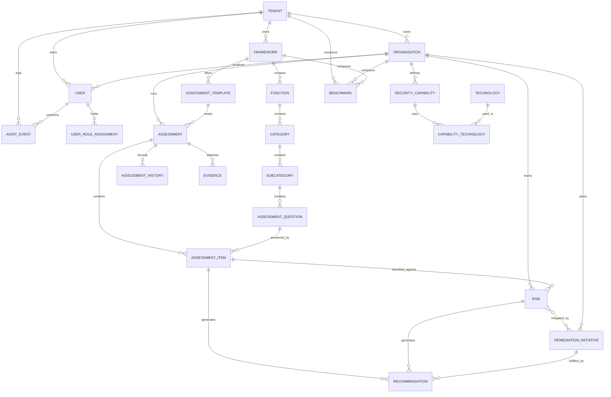

# Data Model

This documents the actual Prisma schema (`packages/database/prisma/schema.prisma`,
28 models) as implemented, not an aspirational sketch. Every model, field, and
relation below is grep-able in that file. See `docs/architecture.md` for a
higher-level, earlier-authored system diagram — where the two disagree, this
document and the schema file are authoritative.

## Conventions used throughout the schema

- **Primary keys**: `String @id @default(uuid())` everywhere — no serial/int IDs.
- **Multi-tenancy**: every tenant-owned model carries a `tenantId` (top-level
  models) or reaches its tenant transitively through `organisationId` /
  a parent relation. `Tenant` and `User` are the only two truly global
  concepts; everything else is scoped under a tenant, and most business data
  is scoped under an `Organisation` within that tenant.
- **Soft deletion**: models that support it carry a nullable `deletedAt`
  (`Tenant`, `Organisation`, `User`, `Framework`, `Assessment`,
  `Evidence`, `Risk`, `RemediationInitiative`, `UserRoleAssignment`). There is
  no ORM-level "exclude soft-deleted rows automatically" behavior — each
  service's Prisma queries are responsible for filtering `deletedAt: null`
  where that matters.
- **Enums are real Postgres enums** (`@@map`'d to snake_case), not just
  TypeScript unions — `maturity_level`, `risk_level`, `control_status`,
  `audit_action`, `user_role`. Several string-typed "status" fields
  (`Assessment.status`, `Risk.status`, `RemediationInitiative.status`,
  `ImportJob.status`, `ImportRecord.status`) are deliberately plain `String`
  columns instead: their allowed values are enforced in application code
  (state machines in `AssessmentsService`, simple field validation
  elsewhere), not at the database level — see the note in each section below.

## Entity groups

### Tenant & Organisation

```
Tenant (1) ──── (N) Organisation
Tenant (1) ──── (N) User            // a user belongs to exactly one tenant
Tenant (1) ──── (N) Framework       // frameworks are tenant-scoped, not global
Tenant (1) ──── (N) AuditEvent
Organisation (1) ──── (N) User      // a user's org within its tenant (nullable)
```

- `Tenant` — top-level customer boundary. `slug` is globally unique.
- `Organisation` — a business unit within a tenant (e.g. a subsidiary or
  division). `slug` is unique *per tenant* (`@@unique([tenantId, slug])`),
  not globally — two different tenants can both have an `"acme"` org.
  Almost every business object (`Assessment`, `Risk`,
  `RemediationInitiative`, `SecurityCapability`, `Benchmark`) hangs off an
  `Organisation`, not directly off a `Tenant`.

### Users, Roles & RBAC

```
User (1) ──── (N) UserRoleAssignment
```

- `User.passwordHash` is nullable (room for a future non-password auth
  method) and `bcryptjs`-hashed when present (see `apps/api/src/auth`).
- `User.passwordChangedAt` (nullable `DateTime`) is stamped by
  `POST /auth/change-password` and otherwise left untouched. It isn't a
  general "last modified" audit field — it's read by exactly one place
  (`JwtStrategy.validate()`) to reject any JWT issued before that moment,
  which is how a password change revokes every other outstanding token
  for that user without a separate per-session token table to enumerate.
- `User` has **no single `role` column in the schema** — role is entirely
  represented via `UserRoleAssignment`, a join-style table allowing a user
  to hold *multiple* roles, optionally scoped to a specific
  `organisationId` within their tenant (nullable — an assignment with no
  `organisationId` is tenant-wide). `AuthService.login()` reads all of a
  user's active assignments into a `roles: UserRole[]` array on the issued
  JWT payload (plus a `role` convenience field = `roles[0]`, kept only for
  backward compatibility with older code paths — see the Phase 14 "found
  and fixed" note in `IMPLEMENTATION_STATUS.md` for the bug this asymmetry
  once caused in `RolesGuard`).
- The 11-value `UserRole` enum (`PLATFORM_ADMIN`, `ORGANISATION_ADMIN`,
  `CISO`, `SECURITY_ARCHITECT`, `GRC_MANAGER`, `ASSESSOR`, `CONTROL_OWNER`,
  `REMEDIATION_OWNER`, `AUDITOR`, `EXECUTIVE_VIEWER`, `READ_ONLY_VIEWER`) is
  the single source of truth for role names, shared between the Postgres
  enum, `@cmmp/shared`'s TypeScript type, and every controller's
  `@Roles(...)` decorator. See `docs/security-architecture.md` for the full
  per-endpoint permission matrix.
- `Role` (a separate model with a free-text `permissions: String[]`) exists
  in the schema but **is not read or written by any service** — it predates
  the simpler enum-based `UserRoleAssignment` approach that was actually
  built, and is unused scaffolding today.
- `RevokedToken` (`jti` primary key, `tenantId`, `userId`, `expiresAt`,
  `revokedAt`) is the token-revocation blacklist — not tied to `User` by a
  foreign key (a revoked token's user may since have been deleted; the
  row's only job is answering "is this `jti` dead," not describing a
  user). Written by `POST /auth/logout` and `POST /auth/refresh`
  (rotation), read by `JwtStrategy.validate()` on every authenticated
  request. See `docs/security-architecture.md`'s "Token revocation."

### Frameworks & the assessment hierarchy

```
Framework (1) ──── (N) Function
Function  (1) ──── (N) Category
Category  (1) ──── (N) Subcategory
Subcategory (1) ──── (N) AssessmentQuestion
```

- This four-level tree (`Framework → Function → Category → Subcategory →
  AssessmentQuestion`) is deliberately framework-agnostic — nothing here
  hard-codes NIST CSF. `Framework.frameWorkType` (a free-text field, e.g.
  `"NIST_CSF"`) is metadata only; the hierarchy shape works equally well
  for ISO 27001 or CIS Controls, which is the whole point of
  `@cmmp/framework-engine` (see `docs/framework-model.md`).
  `(frameworkId, slug, version)` is unique together, so the same slug can
  have multiple versions coexisting.
- `AssessmentQuestion` is the leaf: one row per subcategory today (NIST CSF
  has no separate "question" concept beyond its outcome statements), but
  the schema allows a subcategory to own more than one question — a future
  framework with a real question bank per outcome doesn't need a schema
  change.
- `MaturityModel` / `MaturityModelLevel` exist in the schema (a
  configurable N-level scale with per-level name/color) but, per ADR-007,
  **nothing currently reads or writes them** — `@cmmp/scoring-engine`'s
  `MATURITY_LEVEL_SCORES` map is a hard-coded 1–5 scale keyed off the
  `MaturityLevel` enum instead. These two tables are the seam a future
  per-tenant custom maturity model would attach to; today they're inert.

### Assessments

```
AssessmentTemplate (1) ──── (N) Assessment      // optional
Organisation (1) ──── (N) Assessment
Assessment (1) ──── (N) AssessmentItem
Assessment (1) ──── (N) AssessmentHistory
Assessment (1) ──── (N) Evidence
AssessmentQuestion (1) ──── (N) AssessmentItem
```

- `Assessment.status` is a plain `String` (`DRAFT`, `IN_PROGRESS`,
  `SUBMITTED`, `APPROVED`, `ARCHIVED`) whose legal transitions are enforced
  entirely in `AssessmentsService` (see `docs/scoring-methodology.md` and
  Phase 6 in `IMPLEMENTATION_STATUS.md` for the state machine) — the
  database has no `CHECK` constraint on it.
  `@@unique([organisationId, name, deletedAt])` allows re-using a name once
  the old assessment with that name is soft-deleted (a distinct,
  non-`null` `deletedAt` value makes the tuple unique again).
- `AssessmentItem` is the actual unit of assessment: one row per
  `(assessmentId, questionId)` pair, created in bulk when `POST
  /assessments` resolves the chosen framework's full question list (Phase
  6). It carries *both* the scoring axis (`currentMaturity`/
  `targetMaturity`, `MaturityLevel` enum, `weight: Float` defaulting to
  1.0 — see ADR-007) and the workflow axis (`riskLevel`,
  `businessCriticality` 1–5, `controlStatus`, free-text `rationale` /
  `evidence` / `assessorComments`, and an owner name/email +
  `remediationDueDate` for tracking who's on the hook). `weight` is
  threaded through the whole scoring engine already but nothing today sets
  it to anything but the default — see `docs/scoring-methodology.md`.
- `AssessmentHistory` is an append-only audit trail of status transitions
  only (`version`, `status`, and the maturity scores *at that point*) —
  distinct from the tenant-wide `AuditEvent` log, which captures every
  create/update/delete across all resources, not just assessment
  transitions.
- `Evidence` (file upload metadata: name/MIME/size/`storagePath`) exists in
  the schema and is linked from `Assessment`, but **no controller or
  service reads or writes it today** — file-based evidence upload was
  scaffolded in Phase 1 and never built; the only "evidence" a user can
  actually record today is the free-text `AssessmentItem.evidence` field.

### Risk Register & Remediation

```
Organisation (1) ──── (N) Risk
AssessmentItem (1) ──── (N) Risk                 // optional linkage
Risk (N) ──── (N) RemediationInitiative           // implicit join table
Organisation (1) ──── (N) RemediationInitiative
```

- `Risk.inherentRiskScore` is always **server-computed** as
  `likelihood × impact` (both 1–5, so 1–25) — never trusted from the
  client (`apps/api/src/risks/risks.service.ts`). `riskLevel` is
  auto-suggested from that score via `suggestRiskLevel()` (thresholds:
  ≥20 CRITICAL, ≥12 HIGH, ≥6 MEDIUM, ≥3 LOW, else MINIMAL) when the caller
  doesn't supply one; an explicit `riskLevel` always wins. `residualRiskScore`
  (post-control) exists in the schema but nothing computes it yet — it's
  settable but not derived.
- `Risk.assessmentItemId` is the risk-to-control mapping: a risk can
  (optionally) point at the specific `AssessmentItem` it was identified
  against, which is how the assessment dashboard's Risk Summary panel
  traces risks back to a specific assessment (`Risk` itself has no
  `assessmentId` — only this indirect path through `AssessmentItem`).
- `Risk ↔ RemediationInitiative` is a genuine many-to-many (Prisma implicit
  join table, no explicit join model) — one risk can be mitigated by
  several initiatives, and one initiative can address several risks. Both
  `RisksService` and `InitiativesService` expose symmetric
  connect/disconnect endpoints onto the same relation.
- `Recommendation` sits between `Risk`/`AssessmentItem` and
  `RemediationInitiative` in the schema (one recommendation can link an
  item, a risk, and an initiative all at once) but, like `Evidence`, **is
  not created or read by any service** — remediation in this codebase
  flows directly `Risk ↔ RemediationInitiative`, skipping this
  intermediate model entirely. It's inert scaffolding, not a bug.

### Security Capabilities & Benchmarking

- `SecurityCapability` (an organisation's named capability, e.g. "Identity
  & Access Management", with its own current/target `MaturityLevel`) and
  its `CapabilityTechnology` join to `Technology` are fully modeled but, as
  of this writing, have **no controller** — `securityCapability` on
  `RemediationInitiative` is just a free-text label (the initiative's
  function display name today), not a foreign key into this table. This is
  the gap Phase 12's write-up calls "`SecurityCapability`-aware
  categorization" as future work.
- `Benchmark` (industry-average / anonymized / custom maturity comparisons,
  optionally scoped to an organisation and/or framework) is likewise
  modeled with no controller — a future benchmarking feature's landing
  spot, not yet surfaced anywhere.

### Audit Logging

```
Tenant (1) ──── (N) AuditEvent
User   (1) ──── (N) AuditEvent
```

- `AuditEvent.action` is the one place a real Postgres enum
  (`AuditAction`: `LOGIN`, `LOGOUT`, `CREATE`, `UPDATE`, `DELETE`,
  `UPLOAD`, `DOWNLOAD`, `EXPORT`, `IMPORT`) backs a workflow-style field —
  unlike `Assessment.status`/`Risk.status`, this one *is* database-enforced,
  since its value set is small, stable, and never needs
  application-defined custom values.
  `AuditEvent.user` uses `onDelete: Restrict` — deliberately, so a user row
  can never be hard-deleted out from under its own audit trail (soft
  deletion via `deletedAt` is always the path for a departing user).
  `AuditEvent.tenant`, by contrast, uses `onDelete: Cascade` — deleting a
  `Tenant` deletes its audit trail with it, which is why the DB-level
  immutability trigger below is scoped to `UPDATE` only, not `DELETE`.
- A Postgres trigger (`audit_events_no_update`, added by a raw-SQL
  migration Prisma's schema DSL can't express — `packages/database/prisma/
  migrations/*_audit_events_immutable_update`) rejects any `UPDATE`
  against this table unconditionally, for every role. See
  `docs/security-architecture.md`'s "Audit logging" section for the full
  reasoning, including why `DELETE` is deliberately left alone.

  See `docs/security-architecture.md` for how logging is wired
  (`AuditInterceptor`) and its immutability guarantees.

### Data Import

```
ImportJob (1) ──── (N) ImportRecord
```

- Deliberately **not** tenant/assessment-scoped by a foreign key beyond
  `organisationId` — `ImportJob`/`ImportRecord` are a generic "any bulk
  operation" audit trail, and today's only producer is the assessment
  response importer (`POST /assessments/:id/import`). See
  `docs/excel-import-guide.md` for the full row-status lifecycle
  (`VALID`/`WARNING`/`ERROR`) these two tables persist.

### Dashboard Configuration

- `DashboardConfiguration` (per-organisation saved layout/widget JSON) is
  modeled but unused — the actual dashboard (`docs/api-reference.md`'s
  `GET /assessments/:id/dashboard*` family) is a fixed, code-defined set of
  widgets today, not user-configurable.

### Platform Settings

- `PlatformSetting` — a plain key/value table (`key` is itself the primary
  key), added specifically so a `PLATFORM_ADMIN` can set the Anthropic API
  key that powers `AiMappingService`'s column-mapping suggestion
  (`docs/excel-import-guide.md`) live, from `/admin/settings`, instead of
  only via an environment variable requiring a redeploy. `value` is always
  AES-256-GCM ciphertext (`@cmmp/security`), never plaintext — this is the
  one table in the schema that exists specifically to hold live secrets,
  not application data or preferences. No `updatedById` column: who
  changed a setting and when is already captured by the generic
  `AuditEvent` interceptor (every `PUT`/`DELETE` on `SettingsController` is
  logged like any other mutating request), so duplicating that here would
  be redundant. Platform-wide, not tenant-scoped — there is exactly one
  row per setting key across the whole installation, matching how the
  environment variable it can override behaves today. See
  `docs/security-architecture.md`'s "Runtime-configurable secrets" for the
  full encryption design.

## Full entity-relationship diagram



## Migration history

There is currently one committed migration,
`packages/database/prisma/migrations/20260901072626_init/`, applied against
a real PostgreSQL 16 instance and verified end-to-end (see "First
End-to-End Verification" in `IMPLEMENTATION_STATUS.md`). Schema changes go
through `prisma migrate dev` locally and `prisma migrate deploy` in
`docker-compose.yml`'s `api` service command and in CI's
`integration-tests`/`e2e-tests` jobs (`npm run db:migrate`) — never
`prisma db push` in any environment that needs a migration history.
